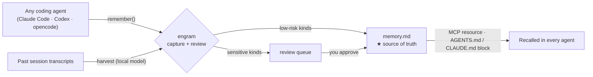

# Engram

**An agent-agnostic memory layer.** Capture facts about you and your work from *any* coding agent, review them on your terms, and recall them everywhere.

One local store your coding agents write to and read from — kept as plain Markdown you own, served over the [Model Context Protocol](https://modelcontextprotocol.io). Works with Claude Code, Codex, opencode, and any MCP-capable client, driving cloud or local models (LM Studio, Ollama) alike.

> **Status:** early development. The core engine and MCP server are being built in the open. APIs will change.

## Why

Coding agents forget everything between sessions. Workarounds exist, but each is locked to one tool: every harness has its own memory, and none of them share. And the ones that do remember will happily store *anything* — including things you'd never want written down automatically.

Engram is the shared brain: **one** local store every agent reads from and writes to, with **you** as the gatekeeper for anything sensitive.

## How it works



- **Capture** — agents call a `remember` tool mid-task, or Engram harvests durable facts from session transcripts using a local model.
- **Review** — low-risk kinds (you choose which) are logged automatically; sensitive kinds wait in a queue you approve. Any promoted fact can be retracted with `engram forget`. Nothing rewrites your curated memory without consent.
- **Recall** — every agent loads your memories through an MCP resource or a generated `AGENTS.md` / `CLAUDE.md` context block.

**A fact's journey.** Your agent calls `remember("prefers pnpm over npm", tooling)` — `tooling` is a low-risk kind, so it lands in `memory.md` and shows up in recall right away. Later it captures `remember("VAT number is 12345678X", fiscal)` — `fiscal` is sensitive, so Engram **won't** auto-write it; it waits in the review queue until you run `engram promote <id> --confirm`. Both end up as plain Markdown you can read, `git diff`, and `engram forget`.

## Where your memory lives

Everything is plain files in one folder — your store directory (default `~/.local/share/engram`). The **YAML frontmatter of `memory.md` is the single source of truth**; every other surface is generated from it.

| File | What it is | |
|---|---|---|
| `memory.md` *(frontmatter)* | the registry — every promoted fact plus its metadata (kind, source, confidence, status, decay…) | **★ source of truth** |
| `memory.md` *(body)* | readable `## kind` bullet list | generated from the registry |
| `AGENTS.md` / `CLAUDE.md` block, MCP recall | what agents actually read | rendered on demand |
| `memory-log.md` | append-only log of low-risk auto-captures | secondary record |
| `queue/*.json` | facts awaiting your review | staging, not yet truth |
| `audit.jsonl`, `.bak/` | append-only audit trail + one-step undo | history |

To change a fact, edit the frontmatter or use the CLI (`remember` / `promote` / `forget`) — don't hand-edit the generated body, it's overwritten on the next write. Because it's just files in a folder, your whole memory rides whatever already backs that folder up (Git, Dropbox, a NAS).

## How it compares

### vs. a plain `CLAUDE.md` / instructions file

A `CLAUDE.md` is hand-written **instructions for one tool** — *how* an agent should behave. Engram is a harvested, reviewed **knowledge base of facts about you** — *what's* true — shared across **every** agent. They're complementary:

| | A plain `CLAUDE.md` / text file | Engram |
|---|---|---|
| Holds | Instructions & policy you write | Facts captured about you and your work |
| Scope | One tool, one repo | Every agent, one shared store |
| Trust | Anything written is instantly live | Sensitive facts gated behind your approval |
| Lifecycle | Static; goes stale silently | `confidence`, `decay`, `last_verified`, dedup, conflict flags, `doctor` |
| Upkeep | You type it all by hand | Auto-harvested from past sessions |

Use a `CLAUDE.md` for *how to behave*; use Engram for *what's true about you* — especially once you have more than one agent and facts you don't want auto-written.

### vs. a typical memory tool

Most memory tools are vector stores the agent writes to directly. Engram takes a different stance:

| | Typical memory tool | Engram |
|---|---|---|
| Capture | Agent writes directly | Federated across the agents you already use |
| Trust | Whatever the agent stored | Human review gate on sensitive writes |
| Storage | Vector DB | Plain Markdown + YAML you own, git-diffable |
| Hosting | Often cloud | Local-first, no telemetry |
| Models | Provider-specific | Any OpenAI-compatible endpoint |

## Supported clients

| Client | Capture | Recall |
|---|---|---|
| Claude Code | MCP tool + transcript harvest | MCP resource + `CLAUDE.md` block |
| Codex | MCP tool + transcript harvest | MCP resource + `AGENTS.md` block |
| opencode | MCP tool + transcript harvest | MCP resource + `AGENTS.md` block |
| Any MCP client | MCP tool | MCP resource |

## Quickstart

Not yet on PyPI — install from source:

```bash
uv tool install git+https://github.com/xantorres/engram
# or: pipx install git+https://github.com/xantorres/engram
# or from a clone: uv tool install .

engram remember "I prefer pnpm over npm"    # stage a fact (pending review)
engram list --status pending                # see what's staged
ENGRAM_AUTOPROMOTE=true engram sync --apply  # promote the low-risk ones
engram recall                               # recall promoted memories
engram serve                                # start the MCP server for your agents
```

Wire it into an agent (Codex shown):

```toml
# ~/.codex/config.toml
[mcp_servers.engram]
command = "engram-mcp"
```

## Design principles

- **Local-first.** Your memories never leave your machine. No telemetry.
- **You own the data.** Plain Markdown + YAML, git-diffable, no database lock-in.
- **Human in the loop.** Tiered writes: auto-log the trivial, gate the sensitive.
- **Bring your own model.** Any OpenAI-compatible endpoint extracts memories — cloud or local.

## Documentation

- [Quickstart](examples/quickstart.md)
- [Architecture](docs/ARCHITECTURE.md)
- [Security and privacy](docs/SECURITY.md)
- [Adapters](https://github.com/xantorres/engram/tree/main/adapters)

## License

[MIT](LICENSE)
