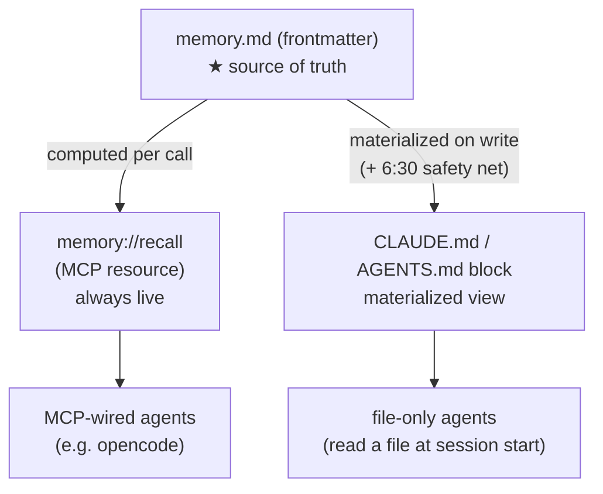

# How recall stays fresh

Recall is *what an agent actually reads* about you. Engram exposes it two ways,
and the difference matters for freshness.



## The three surfaces

| Surface | Freshness | Who reads it |
|---|---|---|
| **`memory.md` frontmatter** | the source of truth — live | nothing reads it directly; everything is derived from it |
| **`memory://recall` (MCP)** | live, recomputed on every call | agents wired to the MCP server |
| **`CLAUDE.md` / `AGENTS.md` block** | a *materialized view* of recall | agents that only read a file at session start |

## Why a materialized copy exists at all

Not every agent speaks MCP. Many read a context file once, at session start. For
them, recall has to be **written into a file** ahead of time — the
`<!-- engram:begin -->…<!-- engram:end -->` block. That block is a cache of what
`memory://recall` would return: promoted-only, stale facts filtered out,
optionally scoped to a project.

A cache can go stale. Engram keeps it fresh two ways:

1. **Auto-refresh on write (primary).** When promoted state changes — `engram sync
   --apply`, `engram promote`, `engram forget` — Engram rewrites every configured
   block immediately. Opt in with:

   ```toml
   # ~/.config/engram/config.toml
   [recall]
   auto_refresh = true
   refresh_targets = ["~/docs/CLAUDE.md", "~/docs/AGENTS.md"]
   limit = 30
   ```

   The block is written with a temp-file + rename swap that preserves your file's
   mode and leaves no `.bak`/`audit.jsonl` beside it — the store's own machinery
   stays in the store directory.

2. **Daily snapshot (safety net).** A scheduled `engram gen-context --write …` run
   (e.g. a 6:30 launchd job) rewrites the same blocks. With `auto_refresh = true`
   this is redundant insurance; with it off, it's the only thing keeping the
   blocks current and they can lag up to a day.

## When a block can still lag

Only when `auto_refresh` is off (or `refresh_targets` is empty) **and** you rely on
the daily job alone. In that window the file block reflects the store as of the
last snapshot, not the latest write. The MCP resource never lags. If freshness
matters and an agent can't use MCP, turn `auto_refresh` on.

## Project scope

Both surfaces accept an optional project filter. A scoped block carries that
project's facts **plus** your unscoped global facts (universal preferences), so a
per-project context never loses the basics:

```bash
engram gen-context --project <slug> --write ~/code/myapp/CLAUDE.md
```
